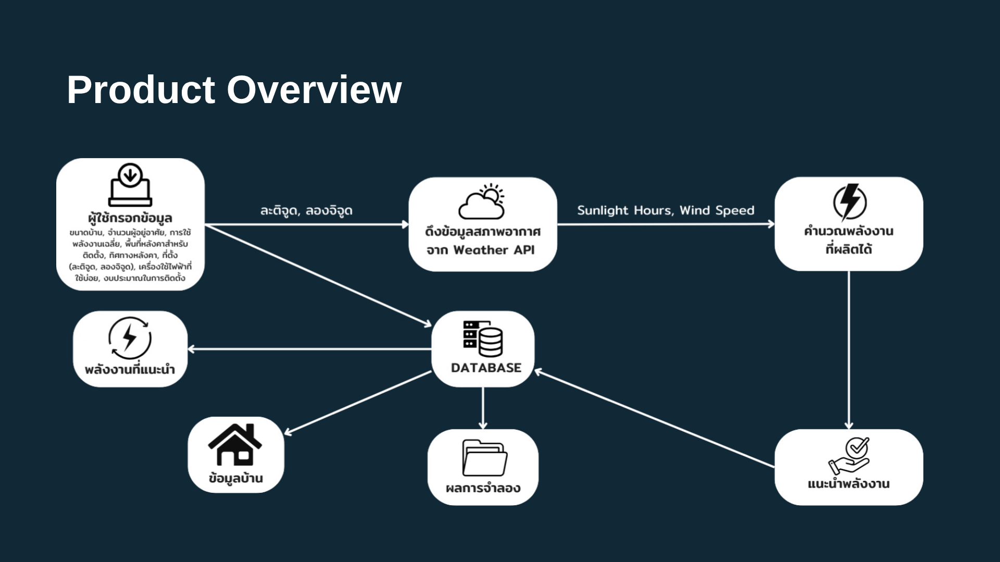

# 🌿 RenewWise: ระบบวิเคราะห์และจำลองพลังงานหมุนเวียนภายในบ้าน

**RenewWise** คือแอปพลิเคชันที่ช่วยประเมิน จำลอง และให้คำแนะนำเกี่ยวกับการใช้พลังงานหมุนเวียนในครัวเรือน เพื่อให้ผู้ใช้งานสามารถตัดสินใจติดตั้งระบบพลังงานได้อย่างมั่นใจ ประหยัด และเหมาะสมกับลักษณะบ้านของตนเอง

## 📌 คุณสมบัติหลัก

- 🔍 **วิเคราะห์และแนะนำพลังงานหมุนเวียน**  
  วิเคราะห์ข้อมูลบ้านและสภาพอากาศเพื่อแนะนำพลังงานที่เหมาะสม เช่น พลังงานแสงอาทิตย์ พลังงานลม หรือผสมผสานหลายแหล่ง

- 💡 **จำลองผลลัพธ์การผลิตพลังงาน**  
  ประเมินการผลิตพลังงานต่อเดือน เปรียบเทียบกับการใช้งานปัจจุบัน พร้อมคำนวณต้นทุนติดตั้งและการประหยัดพลังงาน

- 📈 **คำนวณระยะเวลาคืนทุน (Payback Period)**  
  แสดงข้อมูลความคุ้มค่า พร้อมระยะเวลาคืนทุนโดยประมาณแบบเข้าใจง่าย

## 🛠️ เทคโนโลยีที่ใช้

- **Frontend**: Flutter  
- **State Management**: Provider  
- **Weather Data API**: OpenWeatherMap

##  Overview

## 🗃️ โครงสร้างฐานข้อมูล

| Attribute | Type | Description |
|----------|------|-------------|
| `keyID` | Integer | รหัสข้อมูล (Primary Key) |
| `energyType` | String | ประเภทพลังงานที่แนะนำ |
| `houseSize` | Double | ขนาดพื้นที่บ้าน |
| `numberOfResidents` | Integer | จำนวนผู้อยู่อาศัย |
| `averageEnergyUsage` | Double | การใช้พลังงานเฉลี่ยต่อเดือน (kWh) |
| `location` | String | ตำแหน่งละติจูดและลองจิจูด |
| `roofArea` | Double | พื้นที่ติดตั้งโซลาร์เซลล์ (ตร.ม.) |
| `roofDirection` | String | ทิศทางหลังคา |
| `appliances` | String | เครื่องใช้ไฟฟ้าภายในบ้าน |
| `installationBudget` | Double | งบประมาณติดตั้งระบบพลังงาน |
| `sunlightHours` | Double | จำนวนชั่วโมงแสงอาทิตย์เฉลี่ยต่อวัน |
| `windSpeed` | Double | ความเร็วลมเฉลี่ย (กรณีพิจารณาพลังงานลม) |

## 🔄 ขั้นตอนการทำงานของระบบ

1. 📥 **รับข้อมูลจากผู้ใช้**: ผ่านแบบฟอร์มกรอกข้อมูล
2. ☁️ **ดึงข้อมูลสภาพอากาศ**: จาก OpenWeatherMap API
3. 🧠 **วิเคราะห์และประมวลผล**: เพื่อให้คำแนะนำด้านพลังงาน
4. 📊 **แสดงผลลัพธ์**: จำลองการผลิตพลังงาน ค่าใช้จ่าย และระยะเวลาคืนทุน
5. ✏️ **ผู้ใช้สามารถแก้ไขหรือลบข้อมูลได้**

## ✅ ประโยชน์ของ RenewWise

- ลดค่าใช้จ่ายด้านพลังงานในระยะยาว  
- ตัดสินใจติดตั้งระบบพลังงานหมุนเวียนอย่างมีข้อมูล  
- สนับสนุนการใช้พลังงานอย่างยั่งยืน เป็นมิตรต่อสิ่งแวดล้อม  
- ใช้งานง่ายด้วย UI ที่ชัดเจนและเป็นมิตรต่อผู้ใช้

---

📌 **ผู้พัฒนา**: นางสาวสิริฉัตร์ ปานน้อย  
📚 **สำหรับโครงงานวิชา**: *Mobile Application Development*  
📅 **ปีการศึกษา**: *1/2567*

